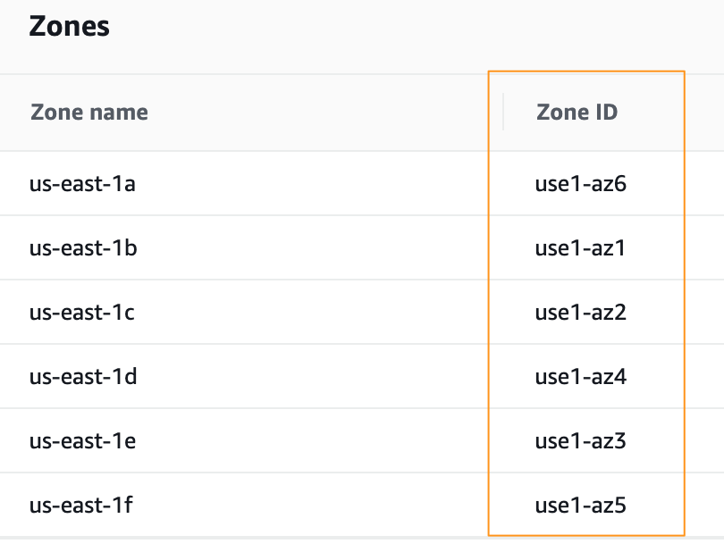

# EC2 instance type supported in AZ and region

This python code is for descibing ec2 instance types supported in each availability zones(AZ) and regions in AWS. 

to run the code: it requires python 3.x and boto3, sys, getopt, json libraries.

---

## Before start
You need to install AWS CLI and configure credential file settings.  
(Installing, updating, and uninstalling the AWS CLI version 2) https://docs.aws.amazon.com/cli/latest/userguide/install-cliv2.html  
(Configuration and credential file settings) https://docs.aws.amazon.com/cli/latest/userguide/cli-configure-files.html  

You can use below to use not default profile  
```console
aws configure --profile <profile name>
```
#### If you want to use your default AWS credentials, you can remove -p argument in the command.

You need IAM permissions as below  
```
{
    "Version": "2012-10-17",
    "Statement": [
        {
            "Sid": "VisualEditor0",
            "Effect": "Allow",
            "Action": [
                "ec2:DescribeInstanceTypeOfferings",
                "ec2:DescribeAvailabilityZones",
                "ec2:DescribeRegions"
            ],
            "Resource": "*"
        }
    ]
}
```


In addition, the output shows AZ ID, which enables you to determine the location of resources in one account relative to the resources in another account.  
https://docs.aws.amazon.com/ram/latest/userguide/working-with-az-ids.html   

In my AWS account it matches as below.  
   


---

### Here are some sample command to run the code

You can find the region code in https://docs.aws.amazon.com/AWSEC2/latest/UserGuide/using-regions-availability-zones.html 
and avaiable instance type in https://aws.amazon.com/ec2/instance-types/?nc1=h_ls


### 1. to get supported instance type in specific AZ and region
```console
python3 ec2instancetype.py -r ap-northeast-2 -i g4dn.2xlarge -p <AWS profile name>
```
The output shows which AZ has the instance type in the region (ap-northeast-2)
```console
[
     {
          "ap-northeast-2": {
               "apne2-az1": [
                    "g4dn.2xlarge"
               ],
               "apne2-az2": "",
               "apne2-az3": [
                    "g4dn.2xlarge"
               ],
               "apne2-az4": ""
          }
     }
]
```

### 2. to get all instance type in specific region
You can use % for instance type argument to get all instance types in AZ and region.
```console
python3 ec2instancetype.py -r ap-northeast-2 -i % -p <AWS profile name>
```
The output shows which AZ has all instance type in the region (ap-northeast-2)
```console
[
     {
          "ap-northeast-2": {
               "apne2-az1": [
                    "c4.2xlarge",
                    "c4.4xlarge",
                    "c4.8xlarge",
                    "c4.large",
                    "c4.xlarge",
                    "c5.12xlarge",
                    "c5.18xlarge",
                    "c5.24xlarge",
                    "c5.2xlarge",
                    "c5.4xlarge",
                    "c5.9xlarge",
                    "c5.large",
                    "c5.metal",
                    "c5.xlarge",
                    "c5a.12xlarge",
                    "c5a.16xlarge",
...
```

### 3. to get all instance family in specific region (not include size of instances)
You can use -f argument to get all instance family in AZ and region.
```console
python3 ec2instancetype.py -r ap-northeast-2 -i % -f -p <AWS profile name>
```
The output shows which AZ has all instance type in the region (ap-northeast-2)
```console
[
     {
          "ap-northeast-2": {
               "apne2-az1": [
                    "c4",
                    "c5",
                    "c5a",
                    "c5d",
                    "c5n",
                    "c6g",
                    "d2",
                    "g3",
                    "g3s",
                    "g4dn",
                    "i2",
                    "i3",
                    "i3en",
                    "inf1",
                    "m4",
                    "m5",
                    "m5a",
                    "m5ad",
...
```

### 4. to find az and region having a specific instance type
You can use % for region argument.
```console
python3 ec2instancetype.py -r % -i g4dn.2xlarge -p <AWS profile name>
```
The output shows which AZ has all instance type in the region (ap-northeast-2)
```console
[
     {
          "ap-northeast-1": {
               "apne1-az1": [
                    "g4dn.2xlarge"
               ],
               "apne1-az2": [
                    "g4dn.2xlarge"
               ],
               "apne1-az4": [
                    "g4dn.2xlarge"
               ]
          }
     },
...
```
### 5. other samples
to get AZ and Asia Pacific region having g4dn instance type 
```console
python3 ec2instancetype.py -r ap% -i g4dn.% -f -p <AWS profile name>
```
to get AZ and Asia Pacific region having .micro instance type 
```console
python3 ec2instancetype.py -r ap% -i %.micro -f -p <AWS profile name>
```
to get AZ having g4dn instance type in ap-northeas-1 and ap-south-1 
```console
python3 ec2instancetype.py -r ap-northeast-1,ap-south-1 -i g4dn.% -f -p <AWS profile name>
```
to check if two or more instance types are supported in AZ and region  
```console
python3 ec2instancetype.py -r ap-northeast-2 -i g4dn.%,m6g% -p <AWS profile name>
```
